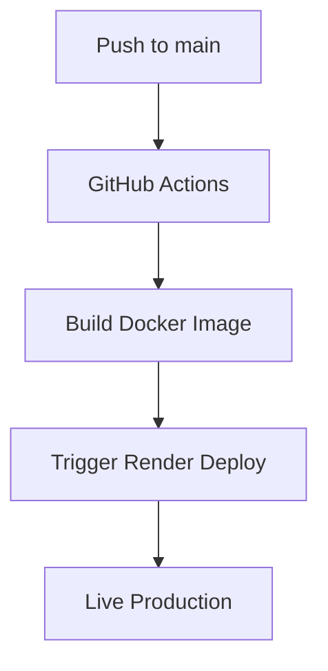

# 🌍 GitHub Actions CI/CD Pipeline with Render Deployment

## 🚀 Project Overview

**Live Demo**: [https://github-action-svw0.onrender.com](https://github-action-svw0.onrender.com)
> ⏳ **Note**: This demo is hosted on the free tier of [Render](https://render.com), which may put the service to sleep when inactive.
> 🕒 It may take **up to 1 minute and 35 seconds** to start — please be patient while the server wakes up.


This project demonstrates a professional-grade CI/CD pipeline for a Spring Boot application using:
- GitHub Actions for automation
- Docker for containerization
- Render for cloud deployment
- Maven for build management

## 🛠️ Technologies Used

| Technology | Purpose |
|------------|---------|
| Spring Boot 3.5.3 | Application framework |
| Java 21 | Runtime environment |
| GitHub Actions | CI/CD automation |
| Docker | Containerization |
| Render | Cloud deployment platform |
| Maven | Build tool |

## 📋 Prerequisites

Before you begin, ensure you have:

1. GitHub account
2. Render account (free tier available)
3. Java 21 JDK installed
4. Docker installed (for local testing)
5. Maven installed

## 🏗️ Project Structure

```
github-action/
├── .github/workflows/  # GitHub Actions workflows
│   └── maven.yml
├── src/                # Application source code
├── Dockerfile          # Docker configuration
├── pom.xml             # Maven configuration
└── README.md           # This documentation
```

## ⚙️ Configuration

### 1. Render Setup

1. Create a new Web Service on [Render Dashboard](https://dashboard.render.com)
2. Configure with these settings:
    - **Language**: Docker
    - **Leave All Defaults**

### 2. GitHub Secrets

Add these secrets to your GitHub repository (Settings → Secrets → Actions):

| Secret Name | Description |
|-------------|-------------|
| `RENDER_API_KEY` | Your Render API key (from Account Settings) |
| `RENDER_SERVICE_ID` | Your Render service ID (from service settings) |

## 🚦 CI/CD Pipeline Workflow

The pipeline executes on every push to `main` branch:

1. **Build Stage**:
    - Checks out code
    - Sets up Java 21
    - Builds Docker image using multi-stage build

2. **Deploy Stage**:
    - Triggers Render deployment via API
    - Automatically deploys the new Docker image



## 🐳 Docker Configuration

The Dockerfile uses multi-stage builds for optimization:

```dockerfile
# Build stage
FROM maven:3.9.6-eclipse-temurin-21-alpine AS builder
...

# Runtime stage
FROM eclipse-temurin:21-jre-jammy
...
```

Key optimizations:
- Reduced final image size (~50% smaller)
- Production-ready JVM tuning
- Non-root user for security
- Health checks
- Proper memory management

## 🌐 API Endpoints

After deployment, your application exposes:

| Endpoint | Method | Description |
|----------|--------|-------------|
| `/api/github/` | GET | Homepage |
| `/api/github/hello` | GET | Simple greeting |
| `/api/github/status` | GET | Service status |
| `/api/github/submit` | POST | Submit data |
| `/api/github/update/{id}` | PUT | Update item |
| `/api/github/delete/{id}` | DELETE | Delete item |
| `/actuator/health` | GET | Health check |

## 🛠️ Local Development

1. Build the application:
   ```bash
   mvn clean package
   ```

2. Build Docker image:
   ```bash
   docker build -t github-action .
   ```

3. Run container:
   ```bash
   docker run -p 8080:8080 github-action
   ```

4. Access at: `http://localhost:8080/api/github/`

## 📊 Monitoring

The application includes Spring Boot Actuator for monitoring:

- Health: `/actuator/health`
- Info: `/actuator/info`
- Metrics: `/actuator/metrics`

## 🔄 Deployment Workflow

1. Make changes to your code
2. Commit and push to `main` branch
3. GitHub Actions automatically:
    - Builds the Docker image
    - Pushes to Render
    - Deploys to production

## 🚨 Troubleshooting

Common issues and solutions:

1. **Build fails**:
    - Check Java version compatibility
    - Verify Maven dependencies

2. **Deployment fails**:
    - Confirm Render API key has proper permissions
    - Check service ID matches your Render service

3. **Application not starting**:
    - Review Docker logs in Render dashboard
    - Verify port configuration matches Render settings

## 📈 Best Practices Implemented

1. **Security**:
    - Non-root Docker user
    - Limited container capabilities
    - Secure JVM options

2. **Performance**:
    - Multi-stage Docker builds
    - Optimized JVM flags
    - Proper resource limits

3. **Reliability**:
    - Health checks
    - Proper error handling
    - Automated rollback on failure

## 📚 Learning Resources

1. [GitHub Actions Documentation](https://docs.github.com/en/actions)
2. [Render Documentation](https://render.com/docs)
3. [Spring Boot Deployment Guide](https://spring.io/guides/gs/spring-boot-docker/)
4. [Java Docker Best Practices](https://docs.docker.com/develop/develop-images/dockerfile_best-practices/)

## 🏆 Professional Benefits

This project demonstrates your skills in:
- Modern CI/CD implementation
- Cloud-native application development
- Containerization best practices
- Production-grade deployment strategies
- Automation and DevOps principles

## 🤝 Contribution Guidelines

1. Fork the repository
2. Create your feature branch
3. Commit your changes
4. Push to the branch
5. Create a new Pull Request

## 📜 License

This project is open-source and available under the [MIT License](LICENSE).

---
